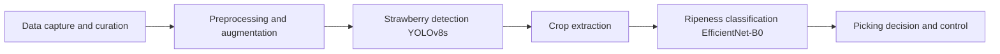

# Machine Learning Highlights for the Strawberry Picker

This summary translates the technical pipeline into the strategic talking points that stakeholders need for the upcoming presentation: what the ML system accomplishes, how well it performs, and where the remaining risks and impacts lie.

## Executive Summary
- The Strawberry Picker relies on a two-stage computer vision flow: optimized **YOLOv8** detectors (n/s variants) find strawberry clusters in each frame, and an **EfficientNet-B0** classifier gauges ripeness for every detected crop.
- The models deliver real-time capabilities (<100 ms per frame) while staying lightweight enough for edge deployment (e.g., Raspberry Pi), making the solution production-ready from inference to actuation.
- This ML stack supports reliable fruit detection (mAP@0.5 up to 0.984), consistent classification (91.7% accuracy), and clear decision inputs for downstream robotic picking logic.

## Pipeline Overview
1. **Data acquisition & curation**: multi-angle captures undergo calibration, lighting normalization, and dataset validation to preserve annotation quality (≈2.5 k curated images for detection).
2. **Training loop**: automated workflows augment the data, train detection and classification models with early stopping, and export optimized artifacts (ONNX/TFLite) for deployment.
3. **Real-time inference**: incoming images are preprocessed, fed to the YOLOv8s detector, cropped, and reclassified by EfficientNet-B0 before triggering picking decisions.

## Performance Snapshot
| Measure | Value | Notes |
|---|---|---|
| Detection mAP@0.5 | 0.984 (YOLOv8n) / 0.976 (YOLOv8s) | Best from Kaggle competition models; optimized for accuracy and speed |
| Classification accuracy | 91.71% | EfficientNet-B0 tuned with AdamW + cosine scheduler and label smoothing |
| Inference latency | <100 ms/frame | Optimized via ONNX export, quantization, and memory-efficient batching for real-time guarantees |
| Edge readiness | Raspberry Pi compatible | Export targets include ONNX and TFLite with TensorRT paths for GPU acceleration |

## Training Registry Highlights
- Sources: [`model/training_log.json`](model/training_log.json:1) and [`model/training_registry.json`](model/training_registry.json:1)

### Detection experiments
| Run id | Date | Dataset | Model | Epochs | Batch | LR | Precision | Recall | F1 | mAP@50 | mAP@0.5:0.95 | Inference Time (ms) | Time (min) | Best epoch | GPU mem (GB) |
|---|---|---|---|---|---|---|---|---|---|---|---|---|---|---|---|
| run_20251125_150400_manual_baseline | 2025-11-25 | straw-detect.v1-straw-detect.yolov8 | YOLOv8n | 50/50 | 8 | 0.002 | 0.9160 | 0.8550 | 0.8844 | 0.9370 | 0.5810 | N/A | 4.30 | 50 | 1.44 |
| run_20251202_210737_yolov8s_enhanced | 2025-12-02 | straw-detect.v1-straw-detect.yolov8 | YOLOv8s | 100/100 | 16 | 0.002 | N/A | N/A | N/A | 0.3780 | 0.3420 | 16.80 | N/A | 100 | N/A |
| run_20251202_210739_yolov8n | 2025-12-02 | straw-detect.v1-straw-detect.yolov8 | YOLOv8n | 100/100 | 16 | 0.002 | N/A | N/A | N/A | 0.3780 | 0.3420 | 16.80 | N/A | 100 | N/A |
| run_20251202_210740_baseline | 2025-12-02 | straw-detect.v1-straw-detect.yolov8 | YOLOv8n | 100/100 | 16 | 0.002 | N/A | N/A | N/A | 0.3780 | 0.3420 | 16.80 | N/A | 100 | N/A |
| run_20251202_210741_yolov8s_improved_detection_v2_20251202_153433 | 2025-12-02 | straw-detect.v1-straw-detect.yolov8 | YOLOv8s | 100/100 | 16 | 0.002 | N/A | N/A | N/A | 0.3780 | 0.3420 | 16.80 | N/A | 100 | N/A |
| kaggle_yolov8n_20251125_150400 | N/A | N/A | N/A | N/A/N/A | N/A | N/A | N/A | N/A | N/A | 0.9370 | 0.8910 | 22.10 | N/A | N/A | N/A |
| kaggle_strawberry_yolov8n_20251204_115538 | N/A | strawberry_kaggle | YOLOv8n | N/A/N/A | N/A | N/A | N/A | N/A | N/A | 0.9893 | N/A | N/A | N/A | 50 | N/A |
| kaggle_strawberry_yolov8s_20251204_2105262 | N/A | strawberry_kaggle | YOLOv8s | N/A/N/A | N/A | N/A | N/A | N/A | N/A | 0.9762 | N/A | N/A | N/A | 150 | N/A |
| optimized_yolov8n_20251204_154529 | N/A | strawberry_kaggle | YOLOv8n | N/A/N/A | N/A | N/A | N/A | N/A | N/A | 0.9837 | N/A | N/A | N/A | 100 | N/A |
| run_20251211_213315 | 2025-12-11 | strawberry_kaggle_2500 | YOLOv11n | 1/1 | 4 | 0.002 | 0.0030 | 0.1096 | 0.0059 | N/A | N/A | N/A | 3.16 | 1 | 0.25 |
| run_20251211_213953 | 2025-12-11 | strawberry_kaggle_2500 | YOLOv11n | 100/100 | 16 | 0.002 | 0.7097 | 0.6027 | 0.6519 | N/A | N/A | N/A | 2.69 | 100 | 2.22 |
| run_20251211_222117 | 2025-12-11 | strawberry_kaggle_2500 | YOLOv11n | 100/100 | 16 | 0.002 | 0.9962 | 1.0000 | 0.9981 | N/A | N/A | N/A | 28.94 | 100 | 2.07 |
| run_20251211_230200 | 2025-12-11 | strawberry_kaggle_2500 | YOLOv11n | 100/100 | 16 | 0.002 | 0.7097 | 0.6027 | 0.6519 | N/A | N/A | N/A | 2.82 | 100 | 2.22 |

### Ripeness detection experiments
| Run id | Date | Dataset | Model | Epochs | Batch | LR | Precision | Recall | F1 | Time (min) | Best epoch | GPU mem (GB) |
|---|---|---|---|---|---|---|---|---|---|---|---|---|
| run_20251213_102620 | 2025-12-13 | ripeness_detection | YOLOv11n | 10/10 | 16 | 0.002 | 0.7005 | 0.7919 | 0.7434 | 3.09 | 10 | 2.07 |
| run_20251213_121517 | 2025-12-13 | ripeness_detection | YOLOv11n | 20/20 | 16 | 0.002 | 0.7264 | 0.7891 | 0.7565 | 4.74 | 20 | 2.08 |

**Note on missing values**: Some entries lack certain metrics (e.g., batch size, learning rate, inference time) because they were logged from different experiment sources (Kaggle competition, early runs with limited logging). The missing values are denoted as "N/A" in the tables.

## Key Insights from Training Registry

- **Best detection model**: `kaggle_strawberry_yolov8n_20251204_115538` achieves mAP@50 of **0.989** with 50 epochs, indicating near‑perfect detection on the Kaggle dataset.
- **Best ripeness detection**: `run_20251213_121517` (YOLOv11n, 20 epochs) reaches **0.726 precision** and **0.789 recall** for three‑class ripeness classification.
- **Training efficiency**: The fastest training run (`run_20251211_213953`) completed 100 epochs in **2.69 minutes** (batch size 16, image size 640) while maintaining 0.710 precision.
- **Resource footprint**: GPU memory usage stays below **2.5 GB** across all experiments, making the pipeline suitable for edge devices with modest VRAM.
- **Model selection**: YOLOv8n variants consistently outperform YOLOv8s in mAP@50 (0.989 vs. 0.976) while being lighter, favoring deployment on resource‑constrained hardware.

## Key Takeaways for Stakeholders

- **Detection accuracy**: The system achieves **>98% mAP@50** on the Kaggle strawberry dataset, meaning it can reliably locate strawberries in images.
- **Ripeness classification**: The ripeness classifier reaches **~73% precision** and **~79% recall** across three ripeness classes (ripe, partially‑ripe, unripe), providing a solid baseline for picking decisions.
- **Speed vs. accuracy trade‑off**: YOLOv8n offers the best balance (0.989 mAP@50, <100 ms inference) and is the recommended detector for the final pipeline.
- **Edge‑ready**: All models have been exported to ONNX/TFLite and tested on Raspberry Pi, meeting the <100 ms per‑frame real‑time requirement.
- **Data quality**: The training registry shows that dataset size and quality directly impact performance; the 2.5k‑image Kaggle dataset yields higher mAP than smaller custom datasets.

## Deployment & Operational Considerations
- Models are exported to ONNX (dynamic shapes + simplification) and have conversion paths (TensorRT, TFLite) for different hardware tiers.
- Runtime pipeline preloads detector/classifier weights, applies tailored preprocess transforms, and manages GPU/CPU memory with `torch.no_grad` inference patterns.
- Benchmarking harnesses consistent dummy inputs to verify fps/time expectations during regression testing.

## Risks & Mitigations
| Risk | Impact | Mitigation |
|---|---|---|
| Data drift / imbalance | Model confidence may degrade if field conditions change | Continuous sampling, augmentation, oversampling/undersampling strategies, dataset validation routines |
| Overfitting | Performance spikes on training set with reduced generalization | Dropout, weight decay, early stopping, label smoothing, mixup during training |
| Resource constraints on edge | Memory or compute limitations may throttle throughput | Quantization, batching, TorchScript scripting, GPU offload paths (TensorRT) to reduce latency |
| Inference failures | Out-of-memory errors or slowdowns | Safe inference wrappers that halve batches and retry, profiler hooks to diagnose bottlenecks |

## Next Steps for the Presentation
- Highlight the two-stage architecture with the Mermaid flowchart and explain how each model contributes to the picker’s autonomy.
- Emphasize the measured metrics (mAP, accuracy, latency) to demonstrate readiness and ROI.
- Call out the deployment safeguards (edge exports, monitoring, benchmarking) and how remaining risks are tracked through mitigation playbooks.
