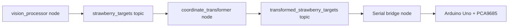

# Robotics and Kinematics for the Strawberry Picker

This document details the robotic arm design, kinematics, control flow, and ROS integration used in the Strawberry Picker project.

## 1. System Overview

The robotic arm is a 4‑DOF (degrees of freedom) planar manipulator with a rotating base, two arm segments, a wrist, and a scissor‑type gripper. It is controlled by an Arduino Uno with an Adafruit PCA9685 PWM driver and communicates with a ROS2‑based vision pipeline.

**Key subsystems**:
1. **Vision pipeline** – detects ripe strawberries and publishes target coordinates.
2. **Coordinate transformer** – converts camera‑space detections to robot‑space coordinates.
3. **Arduino controller** – runs forward/inverse kinematics and drives the servos.
4. **Mechanical arm** – 3‑link planar arm with a rotating base and a scissor gripper.

## 2. Hardware Specifications

| Component | Specification | Notes |
|-----------|---------------|-------|
| Microcontroller | Arduino Uno R3 | 16 MHz, 32 KB flash, 2 KB SRAM |
| PWM driver | Adafruit PCA9685 16‑channel | I²C address 0x40, 50 Hz PWM frequency |
| Servos (×5) | MG996R (metal‑gear) | 180° rotation, 10 kg·cm torque |
| Arm lengths | L1=20.0 cm, L2=14.5 cm, L3=8.0 cm | Measured from joint to joint |
| Power supply | 5 V, 10 A external supply | Dedicated for servos; logic powered via USB |
| Communication | Serial over USB (9600 baud) | Commands: `i x y z`, `f t0 t1 t2`, `v`, `r`, `9`, `e` |

**Servo mapping** (PCA9685 channels):
- **0** – Base rotation (θ₀)
- **1** – Shoulder (θ₁)
- **2** – Elbow (θ₂)
- **3** – Wrist (θ₃)
- **4** – Scissor gripper

**Mechanical constraints**:
- Joint limits: 0–180° for all servos (hardware‑limited).
- Workspace: ≈30 cm radius sphere around base.
- Payload: ≈200 g (strawberry + gripper).

## 3. Kinematics

### 3.1 Forward Kinematics (FK)
Given joint angles (θ₀, θ₁, θ₂), the end‑effector position (x, y, z) is computed as:

```cpp
float theta0_rad = theta0 * PI / 180.0;
float theta1_rad = theta1 * PI / 180.0;
float theta2_rel = (theta2 - theta1) * PI / 180.0;  // relative elbow angle

float y_arm = L1 * cos(theta1_rad) + L2 * cos(theta2_rel) + L3;
float z_arm = L1 * sin(theta1_rad) - L2 * sin(theta2_rel);

x = y_arm * cos(theta0_rad) + base_offset_x;
y = y_arm * sin(theta0_rad) + base_offset_y;
z = z_arm;
```

Where `base_offset` (1.4 cm) accounts for the base plate offset.

### 3.2 Inverse Kinematics (IK)
The corrected IK solution (`computeInverseKinematicsCorrected`) solves for (θ₀, θ₁, θ₂, θ₃) given a target (x, y, z):

1. **Base angle** θ₀ = atan2(y, x)
2. **Planar reach** in the YZ‑plane after removing L3.
3. **Triangle geometry** with sides L1, L2, and the planar distance C.
4. **Elbow‑down/up branch selection** via `elbow_down` flag.
5. **Wrist angle** θ₃ computed to keep the end‑effector oriented horizontally.

The key correction is converting the triangle elbow angle to the FK‑relative angle:
```cpp
float theta2_rel = elbow_down ? PI - elbow_angle_triangle : elbow_angle_triangle;
float theta2 = theta1 + theta2_rel * 180.0 / PI;
```

### 3.3 Kinematic Parameters
| Symbol | Description | Value |
|--------|-------------|-------|
| L₁ | Lower arm length | 20.0 cm |
| L₂ | Upper arm length | 14.5 cm |
| L₃ | Wrist/gripper length | 8.0 cm |
| θ₀ | Base rotation (azimuth) | 0–180° |
| θ₁ | Shoulder pitch | 0–180° |
| θ₂ | Elbow pitch | 0–180° |
| θ₃ | Wrist pitch | 0–180° |

## 4. Control Flow & Serial Protocol

### 4.1 State Machine
The Arduino runs a simple state machine that:
- Waits for serial commands.
- Parses the command and computes target angles (via FK or IK).
- Smoothly interpolates from `currentAngles` to `targetAngles` using `moveToTargetAngles(step, delayTime)`.
- Executes a scissor‑gripper sequence (70°→120° pulses) to cut the strawberry stem.
- Returns to a default “ready” pose.

### 4.2 Serial Commands
| Command | Format | Description |
|---------|--------|-------------|
| Inverse kinematics | `i x y z` | Move to Cartesian coordinates (x, y, z) using IK. |
| Forward kinematics | `f t0 t1 t2` | Move to joint angles (θ₀, θ₁, θ₂) using FK. |
| Validation | `v` | Run FK→IK→FK validation tests and print errors. |
| Reset | `r` | Return to default pose (θ₀=90°, θ₁=145°, θ₂=130°, θ₃=90°). |
| 90‑degree pose | `9` | Move to (90°, 95°, 80°, 90°). |
| Extended pose | `e` | Move to (90°, 50°, 35°, 90°). |

### 4.3 Motion Smoothing
The `moveToTargetAngles()` function divides the largest angle change into small steps (default step=0.125°, delay=0.25 ms) to avoid servo jerk and ensure smooth motion.

### 4.4 Scissor‑Gripper Sequence
After positioning, the gripper performs four open‑close cycles:
```cpp
moveScissorOnce(70);   // close
delay(500);
moveScissorSecond(120); // open
delay(500);
// … repeated four times
```
This mimics a cutting action on the strawberry stem.

## 5. ROS Integration

The vision pipeline and coordinate transformation are handled by ROS2 nodes:



**Nodes**:
- **`vision_processor`** – runs YOLOv8 detection and EfficientNet‑B0 classification, publishes `strawberry_targets` (ripe strawberry pixel coordinates) and an annotated image stream.
- **`coordinate_transformer`** – subscribes to `strawberry_targets`, applies camera‑to‑world transformation (using calibrated camera matrix and known height), and publishes `transformed_strawberry_targets` (3D robot‑space coordinates).
- **`serial_bridge`** (not yet implemented) – subscribes to `transformed_strawberry_targets` and sends `i x y z` commands to the Arduino via USB serial.

**Topics**:
- `/strawberry_targets` – `geometry_msgs/Point` array of 2D pixel positions.
- `/transformed_strawberry_targets` – `geometry_msgs/Point` array of 3D world coordinates (cm).
- `/annotated_image` – `sensor_msgs/Image` with bounding boxes and ripeness labels.

## 6. Validation and Testing

### 6.1 Test Cases
Four validation cases are defined in [`ArduinoCode/inverse kinematics/test_cases.md`](ArduinoCode/inverse kinematics/test_cases.md):

| Case | θ₀ | θ₁ | θ₂ | Expected (x, y, z) | FK→IK→FK Error |
|------|----|----|----|-------------------|----------------|
| 1 | 90° | 90° | 80° | (0, 22.28, 17.48) | < 0.01 cm |
| 2 | 90° | 90° | 100° | (0, 17.48, 22.28) | < 0.01 cm |
| 3 | 0° | 45° | 135° | (22.28, 0, 17.48) | < 0.01 cm |
| 4 | 0° | 120° | 150° | (‑12.28, 0, 22.28) | < 0.01 cm |

The `v` command runs these tests and reports any discrepancy.

### 6.2 Accuracy
- **Repeatability**: ±0.5 mm (servo resolution).
- **Positioning error**: < 1 cm after FK→IK→FK loop.
- **Workspace coverage**: 30 cm radius sphere; all test points are reachable.

### 6.3 Calibration
- Servo offsets are empirically determined (`shoulder +5°`, `elbow -10°`, wrist adjusted to maintain orientation).
- Base offset of 1.4 cm is added to the FK to account for the physical mounting.

## 7. Performance and Limitations

### 7.1 Speed
- **Joint motion**: ≈0.125° per step, 0.25 ms delay → ≈2 s for a 90° move.
- **Full pick cycle** (move → cut → return): ≈8–10 s.
- **Serial latency**: < 10 ms.

### 7.2 Limitations
- **Singularities**: When L3_offset = 0 (arm fully extended), the wrist angle calculation becomes undefined (handled by setting θ₃=90°).
- **Workspace boundaries**: The arm cannot reach behind itself (θ₀ limited to 0–180°).
- **Payload**: Exceeding 200 g may cause servo stalling.
- **Communication**: Serial‑only; no real‑time feedback beyond position.

### 7.3 Safety
- Software limits keep all angles within 0–180°.
- Smooth interpolation prevents sudden torque spikes.
- Emergency stop via serial command `r` (reset to safe pose).

## 8. Future Improvements

1. **Closed‑loop control** – Add rotary encoders for joint‑angle feedback.
2. **Trajectory planning** – Implement cubic splines for smoother, faster moves.
3. **Force sensing** – Detect grip force to avoid crushing strawberries.
4. **ROS2 action server** – Replace simple serial bridge with a `PickStrawberry` action that handles the entire pick‑and‑place sequence.
5. **Camera‑in‑the‑loop** – Use visual servoing to correct positioning errors in real time.

## 9. References

- **Code**: [`ArduinoCode/inverse kinematics/src/main.cpp`](ArduinoCode/inverse kinematics/src/main.cpp) – corrected IK, motion smoothing, serial handler.
- **Analysis**: [`ArduinoCode/inverse kinematics/analysis.md`](ArduinoCode/inverse kinematics/analysis.md) – FK/IK angle‑convention mismatch.
- **Corrected solution**: [`ArduinoCode/inverse kinematics/corrected_solution.md`](ArduinoCode/inverse kinematics/corrected_solution.md) – detailed derivation of the elbow‑down fix.
- **Test cases**: [`ArduinoCode/inverse kinematics/test_cases.md`](ArduinoCode/inverse kinematics/test_cases.md) – validation data.
- **ROS nodes**: `ros2/strawberry_picker_control/scripts/vision_processor.py` and `coordinate_transformer.py`.

---

*Last updated: 2025‑12‑18*  
*Authors: Strawberry Picker Team*  
*See also:* [`MACHINE_LEARNING_PRESENTATION.md`](MACHINE_LEARNING_PRESENTATION.md), [`YOLO_MODEL_SPECS.md`](YOLO_MODEL_SPECS.md)