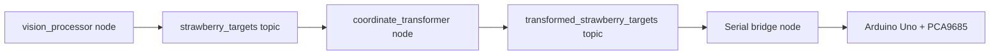

# Robotic Arm Design Document

## 1. System Overview
- **Robot name**: Strawberry picker arm controlled by Arduino Uno and ROS2.
- **Primary subsystems**:
  1. Vision pipeline (`ros2/strawberry_picker_control/scripts/vision_processor.py` → `vision_processor` node) captures imagery and publishes detections/targets.  
  2. Coordinate transformer (`ros2/strawberry_picker_control/scripts/coordinate_transformer.py` → `coordinate_transformer` node) converts camera-space detections into robot-space targets.  
  3. Actuation system (Arduino Uno + Adafruit PWM Servo Driver) executes the computed trajectories and scissor pulses.

## 2. Mechanical and Electrical Architecture
- **Segment lengths**: L1=20.0 cm (lower arm), L2=14.5 cm (upper arm), L3=8.0 cm (gripper/wrist reach) declared in both [`ArduinoCode/forward kinematics/src/main.cpp:10-43`](ArduinoCode/forward kinematics/src/main.cpp:10-43) and [`ArduinoCode/inverse kinematics/src/main.cpp:10-49`](ArduinoCode/inverse kinematics/src/main.cpp:10-49).  
- **Servo layout** (indexes map to PCA9685 channels): 0=base, 1=shoulder, 2=elbow, 3=wrist, 4=scissor. Each uses the same `angleToPulse()` constraint mapping 0–180° into PWM `SERVOMIN` (150) and `SERVOMAX` (600).  
- **Electric path**: Arduino Uno (PlatformIO env `ArduinoCode/inverse kinematics/platformio.ini:11-20`) talks to the PCA9685 driver via I²C and streams status/logging at 9600 baud (`Serial.begin(9600)`). The PWM frequency is set to 50 Hz (`pwm.setPWMFreq(50)` in both sketches).  
- **Servo offsets**: Movement commands add empirical offsets (`shoulder +5°`, `elbow -10°`, `wrist` adjusted to hold orientation) before writing to `targetAngles`, then the smoothing routine in `moveToTargetAngles()` steps through the trajectory to avoid jerk.

## 3. Kinematics
### 3.1 Forward Kinematics
The arm assumes a 3-link planar manipulator with a rotating base and lever lengths L1/L2/L3. The FK routine in [`ArduinoCode/inverse kinematics/src/main.cpp:32-49`](ArduinoCode/inverse kinematics/src/main.cpp:32-49) computes:  
- `theta0` base rotation in azimuth, converted with `cos`/`sin` to distribute planar reach into x and y.  
- `theta1` and relative elbow angle `theta2_rel = theta2 - theta1` contribute to the planar arm extension, and `z` tracks `L1*sin(theta1) - L2*sin(theta2_rel)`.

### 3.2 Inverse Kinematics
The earlier bug stemmed from interpreting the triangle angle directly as `theta2`, which conflicted with the FK convention that `theta2_rel = theta2 - theta1` (see [`ArduinoCode/inverse kinematics/analysis.md`](ArduinoCode/inverse kinematics/analysis.md)). The corrected solution introduces `theta2_rel = PI - elbow_angle_triangle` for the elbow-down branch, then computes:
```
theta2 = theta1 + (theta2_rel * 180.0 / PI)
```
`computeInverseKinematicsCorrected()` also exposes an `elbow_down` flag to guarantee consistency with FK, and the `runValidationTests()` routine ensures FK→IK→FK errors stay below 0.01 cm (see [`ArduinoCode/inverse kinematics/test_cases.md:1-124`](ArduinoCode/inverse kinematics/test_cases.md:1-124)).

## 4. Control Flow & Serial Protocol
- **State machine**: `currentAngles` tracks the last servo positions; new targets are staged in `targetAngles` and interpolated via `moveToTargetAngles(step, delayTime)` (default step `0.125°`, delay `0.25 ms`). The scissor servo is toggled between 70° and 120° to mimic cutting motions.  
- **Serial commands**:
  - `i x y z`: run inverse kinematics on the desired world coordinates and move the arm.  
  - `f t0 t1 t2`: feed-forward FK command that applies offsets before moving.  
  - `v`: run all FK→IK→FK validation cases and print errors for the user.  
  - `r`, `9`, `e`: predefined postures (reset, 90° pose, extended) that call helper functions like `moveToDefaultAngles()` or `moveToExtendedPosition()`.
- **Motion sequencing**: The arm first interpolates joint targets, then pulses the scissor servo to close the gripper multiple times (70→120 loops with 500 ms delays) before returning to defaults, ensuring each pick cycle includes both approach and grip release phases.

```mermaid
flowchart TD
  SerialInput-->CommandProcessor[Command processor]
  CommandProcessor-->Kinematics[Kinematics (FK/IK)]
  Kinematics-->MotionPlanner[Motion planner + offsets]
  MotionPlanner-->PCA9685[Adafruit PCA9685]
  MotionPlanner-->ScissorSequence[Scissor pulse sequence]
  PCA9685-->Servos[Servos (base, shoulder, elbow, wrist, scissor)]
```

## 5. ROS Integration
Vision and calibration nodes feed the arm via ROS topics and services.  
- `vision_processor` publishes `strawberry_targets` (ripe strawberry positions), `strawberry_markers`, and an annotated image stream.  
- `coordinate_transformer` listens to `strawberry_targets`, converts pixel centers to 3D points, and republishes `transformed_strawberry_targets`.  
- A downstream driver node (not in this repo) can subscribe to the transformed targets and send `i x y z` serial commands to the Arduino.



## 6. Validation & Testing
- **Test cases**: four sets of `(θ0, θ1, θ2)` are defined (`90°,90°,80°`, `90°,90°,100°`, `0°,45°,135°`, `0°,120°,150°`) with manual FK targets, ensuring both common and edge configurations are covered (`computeForwardKinematics` and `computeInverseKinematicsCorrected`).  
- **Validation command**: `v` triggers `runValidationTests()` (see [`ArduinoCode/inverse kinematics/test_cases.md:67-124`](ArduinoCode/inverse kinematics/test_cases.md:67-124)) and logs FK input, IK output, recomputed FK result, and the resulting error.  
- **Tolerance**: expect ≤0.01 cm world-space discrepancy for FK→IK→FK loops; the elbow-down flag ensures the arm follows the same branch that FK assumes.

## 7. References
- `ArduinoCode/inverse kinematics/src/main.cpp`: corrected IK, motion smoothing, serial handler, scissor choreography.  
- `ros2/strawberry_picker_control/scripts/vision_processor.py`: detection/classification interface and ROS publishing.  
- `ros2/strawberry_picker_control/scripts/coordinate_transformer.py`: camera-to-world transformation and ROS logging.
